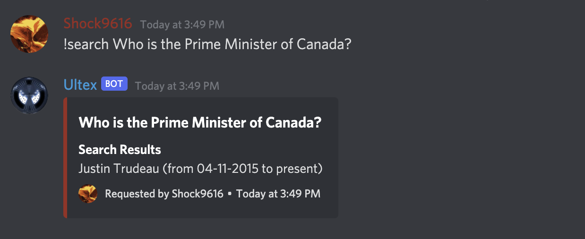
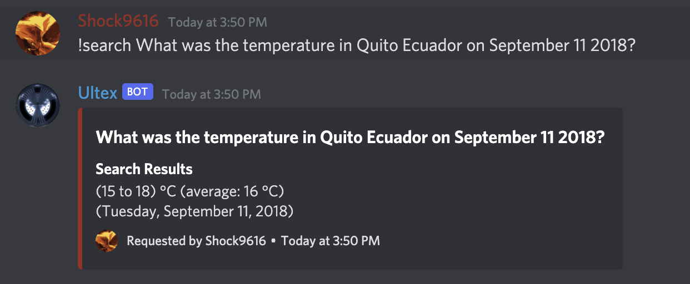

# Ultex

Ultex is a multi-purpose Discord bot with everything from music playback and moderation right down to a random number generator.

## Feature Highlights

* **Music playback**: Provide a YouTube link or a search query and Ultex will play music in your voice channel!
* **Auto-invite**: Provide an/some email address(es), and an email will be sent to it/them with an invite link to your server!
* **XP Leveling**: Users who send messages in the server will earn XP and can view their ranking with the /leaderboard command!
* **Trivia searching**: Just ask a question and an answer will be provided if possible! It could be anything from "Who is the current Prime Minister of Canada?"

to "What was the temperature in Quito Ecuador on September 11 2018?"

* **Server Moderation**: Ultex provides all the basic server moderation commands you could need like kicking, banning, muting, deafening, and even auto-censor of foul language!

*Disclaimer: This bot is still in early stages of development and as such, available commands are liable to change any time.
